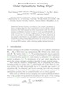

<!-- # Shonan Rotation Averaging: Global Optimality by Surfing SO(p)^n -->
#### ECCV 2020
- <a href="https://dellaert.github.io/">
        Frank Dellaert*
    </a>
    Georgia Institute of Technology
- <a href="https://dellaert.github.io/">
        David M. Rosen*
    </a>
    UC Massachusetts Inst. of Technology
- <a href="https://dellaert.github.io/">
        Jing Wu
    </a>
    Georgia Institute of Technology
- <a href="https://dellaert.github.io/">
        Robert Mahony
    </a>
    Australian National University
- <a href="https://dellaert.github.io/">
    Luca Carlone
    </a>
    Massachusetts Inst. of Technology

*denotes equal contribution

 | | 

## Small World Datasets

## Results
Pivot table with results:

